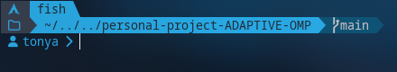
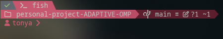
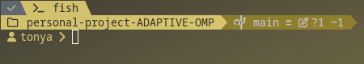
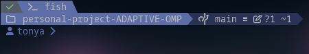

# ADAPTIVE OMP
Oh My Posh theme following system color scheme.

Designed to work with my [fish setup](https://github.com/ToneAr/.fish).

## Preview








## Environment Setup
This theme expects the following environment variables to be setm all as
hex strings:

### Windows
Add this to your $PROFILE to define the required accent environment variables:
```
$accentValue = Get-ItemProperty -Path 'HKCU:\\SOFTWARE\\Microsoft\\Windows\\DWM' -Name 'AccentColor' -ErrorAction SilentlyContinue
    if ($accentValue) {
      $abgr = $accentValue.AccentColor
      $r = $abgr -band 0xFF
      $g = ($abgr -shr 8) -band 0xFF
      $b = ($abgr -shr 16) -band 0xFF
      $hex = '#' + '{0:x2}{1:x2}{2:x2}' -f $r, $g, $b
      
      # Calculate dimmed version (70% brightness)
      $dimR = [int][Math]::Floor($r * 0.7)
      $dimG = [int][Math]::Floor($g * 0.7)
      $dimB = [int][Math]::Floor($b * 0.7)
      $hexDim = '#' + '{0:x2}{1:x2}{2:x2}' -f $dimR, $dimG, $dimB
      
      [System.Environment]::SetEnvironmentVariable('ACCENT_COLOR', $hex, 'Process')
      [System.Environment]::SetEnvironmentVariable('ACCENT_DIM', $hexDim, 'Process')
    }
```

| Variable Name | Description |
| ------------- | ----------- |
| ACCENT_COLOR  | Main accent color |
| ACCENT_DIM    | Dimmed accent color |
| ACCENT_FONT_COLOR | Font color to be used over ACCENT_COLOR |
| ACCENT_DIM_FONT | Font color to be used over ACCENT_DIM |
